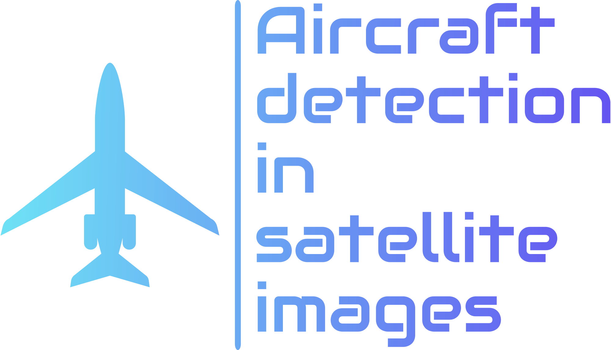

<div align="center">
  
</div>

## Overview 🌍
This project focuses on detecting aircraft in satellite images using various machine learning and computer vision techniques. The workflow includes data preprocessing, feature extraction, clustering, and classification using Support Vector Machines (SVMs).

## Table of Contents 📚

- [Introduction](#introduction)
- [Features](#features)
- [Installation](#installation)
- [Usage](#usage)
- [Workflow Steps](#workflow-steps)
- [Contributors](#contributors)
- [License](#license)

## Introduction

The aim of this project is to develop an automated system for detecting aircraft in satellite imagery. The project utilizes a combination of image processing techniques, feature extraction methods, and machine learning algorithms to achieve high accuracy in aircraft detection.

## Features

- **Training Phase:** Extract data from CSV for SVM training.
- **Template Extraction:** Extract templates from the dataset.
- **Clustering:** Perform K-Means clustering based on size and intensity.
- **Image Resizing:** Resize images within each cluster to uniform dimensions.
- **Eigenplanes Generation:** Generate eigenplanes for the clustered images.
- **Classification:** Classify images using SVM and HOG features.
- **Performance Evaluation:** Evaluate the performance of the classifier.


## Installation 🛠️

1. **Clone the repository:**
    ```sh
    git clone https://github.com/giusalfieri/IPA_Project.git
    cd aircraft-detection-satellite-images
    ```

2. **Install dependencies:**
    Ensure you have OpenCV, CMake, and other necessary libraries installed. You can install the required Python packages using:
    ```sh
    pip install -r requirements.txt
    ```

## Usage

1. **Build the project:**
    ```sh
    mkdir build
    cd build
    cmake ..
    make
    ```

2. **Run the project:**
    ```sh
    ./aircraft_detection [step1] [step2] ...
    ```
    For example, to run the training phase and extract templates:
    ```sh
    ./aircraft_detection training_phase extractTemplates
    ```

## Workflow Steps ➡️➡️➡️

### 1. Training Phase
Initiate the training phase for an SVM model by extracting data from a CSV file.
```sh
./aircraft_detection training_phase
```

Grazie a tutti coloro che hanno contribuito a questo progetto:

| Nome            |  GitHub                                               |
|-----------------|-------------------------------------------------------|
| Alice Bianchi   | [@alicebianchi](https://github.com/alicebianchi)      |
| Mario Rossi     | [@mariorossi](https://github.com/mariorossi)          |
| Lucia Verdi     | [@lucia_verdi](https://github.com/lucia_verdi)        |
| Paolo Neri      | [@paoloneri](https://github.com/paoloneri)            |

---


## License

This project is licensed under the MIT License. See the [LICENSE](License.txt) file for details.

