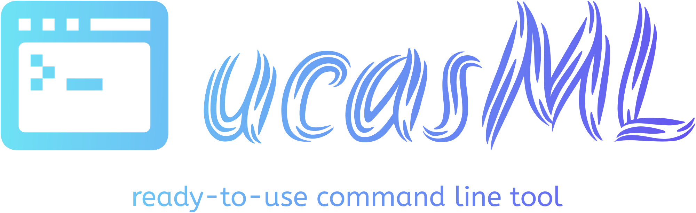
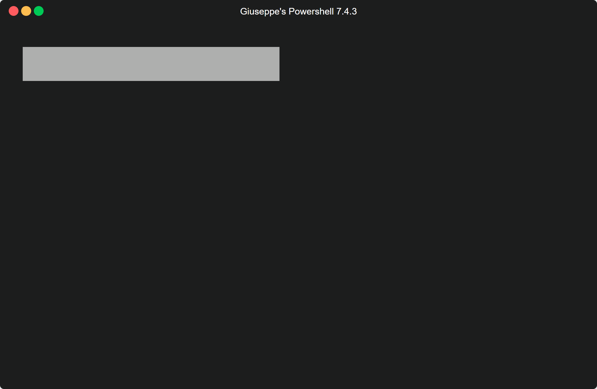

<p align="center">
  
</p>

<p align="center" style="margin-top: 40px;">
    
    
    
    
</p>

## <a name="overview">🌍 Overview</a>

This project focuses on detecting aircraft in satellite images using various Computer Vision and Machine Learning techniques. The workflow includes data preprocessing, feature extraction, clustering, and classification using Support Vector Machines (SVMs).

> [!NOTE]  
> The SVM used in this project is part of the **ucasML** *command-line interface (CLI)* tool.
> <p align="center">
> 
> </p>

> [!IMPORTANT]  
> For detailed instructions on installing **ucasML** tool on your machine, please refer to the *ad hoc* [README](ucasML_package/README.md).

---

## <a name="api-documentation">📖 API Documentation</a>

For a detailed reference of all functions and classes, please refer to the [API Documentation](https://giusalfieri.github.io/IPA_Project/).

---

## 📚 Table of Contents 

- [Introduction](#introduction)
- [Features](#features)
- 📦[Dependencies](#dependencies)
- 🔨[Installation](#installation)
- 🚀[Usage](#usage)
- ➡️ ✅ ➡️[Pipeline](#pipeline)
- 👥[Contributors](#contributors)
- 📜[License](#license)

---

## Introduction

The aim of this project is to develop an automated system for detecting aircraft in satellite imagery. The project utilizes a combination of image processing techniques, feature extraction methods, and machine learning algorithms to achieve high accuracy in aircraft detection.

---

## <a name="features">⚙️ Features</a>

- **Straight airplanes Extraction:** Extract straightened airplanes from the training dataset images.
- **Clustering:** Perform K-Means clustering based on size and intensity on the airplanes previously extracted.
- **Image Resizing:** Resize images within each cluster to uniform dimensions.
- **Eigenplanes Generation:** Generate eigenplanes for the clustered images.
- **SVM Training Data Extraction:** Extract data from CSV for SVM training..
- **Performance Evaluation:** Evaluate the performance of the classifier.

> [!NOTE]  
> The training dataset used is a sub-set of the training dataset of [HRPlanesv2 Data Set](https://github.com/dilsadunsal/HRPlanesv2-Data-Set).

> [!IMPORTANT]  
> For a detailed description of the underlying ***ratio*** of design choices taken, see [project_report.pdf](docs/paper_project.pdf).

---

## <a name="dependencies">📦 Dependencies</a>

[](https://opencv.org/releases/)
[](https://cmake.org/)
[](https://isocpp.org/)
[](https://www.python.org/)

Ensure you have the above installed on your machine:
  

> [!IMPORTANT]  
> Make sure Python is installed system wide (e.g., on Windows, Python must be added to the system `PATH`).
> 
> FFor detailed instructions on how to install OpenCV on your machine, please refer to this [guide](./docs/README.txt).

> [!TIP]  
> Click the badges to visit their official websites.
> 
> For a list of C++20 compliant compilers, click [here](https://en.cppreference.com/w/cpp/compiler_support).

---

## <a name="installation">🔨 Installation</a>

<details>
<summary><strong>Command Line Instructions</strong></summary>

 1. **Clone the repository:**
    ```sh
    git clone https://github.com/giusalfieri/IPA_Project.git
    cd IPA_Project
    ```

2. **Create a build directory:**
    ```sh
    mkdir build
    cd build
    ```

3. **Configure the project using CMake:**
    ```sh
    cmake ..
    ```

4. **Compile the project:**
    ```sh
    make
    ```
5. **Run the project:**
    ```sh
    ./aircraft_detection_project [step1] [step2] ...
    ```
    For example, to run the entire pipeline, see the [Usage](#usage) below.
   
</details>


<details>
<summary><strong>CMake GUI and Visual Studio Instructions</strong></summary>
  
1. **Clone the repository:**
    ```sh
    git clone https://github.com/giusalfieri/IPA_Project.git
    cd IPA_Project
    ```

2. **Open CMake GUI:**
    - Set the "Where is the source code" field to the path of the `IPA_Project` directory.
    - Set the "Where to build the binaries" field to a new `build` directory within the `IPA_Project` directory (e.g., `IPA_Project/build`).

3. **Configure the project:**
    - Click on the "Configure" button.
    - Select your version of Visual Studio (e.g., Visual Studio 2019) and the appropriate platform (e.g., x64).
    - Click "Finish" to start the configuration process.
    - If there are any missing dependencies, resolve them and click "Configure" again.

4. **Generate the project files:**
    - Once the configuration is complete, click the "Generate" button to create the Visual Studio solution and project files.

5. **Open the project in Visual Studio:**
    - Navigate to the `build` directory and open the generated `.sln` file (e.g., `IPA_Project.sln`) with Visual Studio.

6. **Build the project:**
    - In Visual Studio, set the build configuration to `Release` or `Debug` as needed.
    - Build the solution by selecting "Build Solution" from the "Build" menu.

7. **Run the project:**
    - In Visual Studio, set the startup project to `aircraft_detection_project`.
    - Configure the project properties if needed to include any command-line arguments.
    - Start debugging or run the project without debugging as needed.
    - For an example of the command-line arguments to run the entire pipeline, see the [Usage](#usage) below.
 
</details>

---

## <a name="usage">🚀 Usage</a>

To run the *entire* pipeline, use the following command in the directory where the executable is located:

```sh
./aircraft_detection_project extractStraightAirplanes KMeansBySize KMeansByIntensity resizeImagesInClusters generateEigenplanes extract_SVM_Training_Data Performance_evaluation
```

Or you can run individual steps as needed. See the [Pipeline](#pipeline) section for the *exact order* in which the steps should be executed.

> [!NOTE]
> It is **strongly suggested** to execute the steps **one by one**, as some of them are computationally intensive. For example, `extract_SVM_Training_Data` involves *template matching* for numerous images, each with many airplane templates.


---

## <a name="pipeline">➡️ ✅ ➡️ Pipeline</a>


The steps in the pipeline must be executed in the following order to ensure the correct functioning of the process:

1. `extractStraightAirplanes`
2. `KMeansBySize`
3. `KMeansByIntensity`
4. `resizeImagesInClusters`
5. `generateEigenplanes`
6. `extract_SVM_Training_Data`
7. `Performance_evaluation`

Make sure to follow this precise order when running the steps.

> [!IMPORTANT]
> After each phase completes, a `.done` file is created in the `/src/steps_completed folder`. When a command is issued, the program verifies the previous step's completion by checking for the corresponding `.done` file. If the file is missing, a warning message indicates the unmet prerequisite.

> [!NOTE]
> The step `extractStraightAirplanes` has already been completed by us, and its `.done` file is already present inside `/src/steps_completed` folder. 
> Furthermore, the straight airplanes extracted by us, must be downloaded from a Google Drive folder: see this [README.md](./src/straight_airplanes/README.md). 

> [!IMPORTANT]
> Please ensure that the folders `/src/dataset_training`and `/src/dataset_for_straight_airplanes_extraction` are populated as specified in their respective README files: [dataset_training README](./src/dataset_training/README.md) and [dataset_for_straight_airplanes_extraction README](./src/dataset_for_straight_airplanes_extraction/README.md).

> [!IMPORTANT]
> The output of the SVM in cross-validation mode are two `.sco` files. Rename them  `positive.sco` and `negative.sco` and put them inside `/src/svm_cv_outputs` directory.

A detailed description of each step can be found by invoking the executable with the `--help` option:



---
## <a name="contributors">👥 Contributors</a>

| Name              |  GitHub                                               |
|-------------------|-------------------------------------------------------|
| Giuseppe Alfieri  | [@giusalfieri](https://github.com/giusalfieri)        |
| Paolo Simeone     | [@bonoboprog](https://github.com/bonoboprog)          |
| Aurora Pisa       | [@aurorapisa](https://github.com/aurorapisa)          |
| Riccardo D'Aguanno| [@ricdag8](https://github.com/ricdag8)                |
| Gianmarco Luongo  | [@GianmarcoL](https://github.com/GianmarcoL)          |

---

## <a name="license">📜 License</a> 

This project is licensed under the MIT License. See the [LICENSE](License.txt) file for details.

