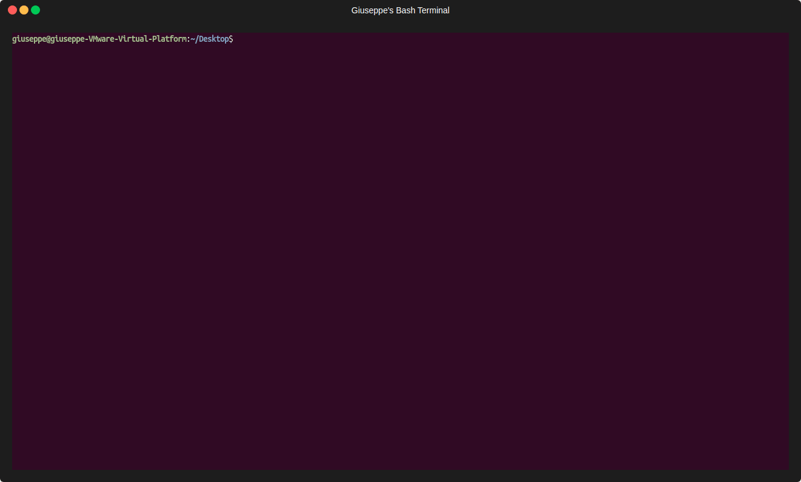

# ucasML Installation Guide


## 📚 Table of Contents 

- 📋[Prerequisites](#prerequisites)
- 🔨[Installation](#installation)
- 🚀[Running the Program](#running-the-program)
- 👨‍💻[Author](#author)

---
## <a name="prerequisites">📋 Prerequisites</a> 


> [!IMPORTANT]  
> The `ucasML` program is designed to run on a **Linux** operating system.
> 
> The OpenCV `.so` libraries included in [opencv_libs.zip](./opencv_libs.zip) have been compiled with a dependency on `GLIBCXX_3.4.32`. This version of `GLIBCXX`is part of `libstdc++`, which comes with GCC (GNU Compiler Collection) **version 12** or later.
> 
>To ensure compatibility, you need to have GCC version 12 or later installed on your system. You can check your current GCC version by running the following command:
> ```sh 
> gcc --version

> [!CAUTION]  
> **Upgrading your GCC is strongly discouraged**: such an action may lead to a broken system. 
> 
> If the above requirement is not met, install or upgrade to a distro which supports GCC version 12 (or later), like the ones we used: see [Tested Linux Distributions](#tested-linux-distributions).

### Tested Linux Distributions

[](https://ubuntu.com/download/desktop)
[](https://www.kali.org)


> [!NOTE]  
> This program has been installed on these Linux distros.

> [!TIP]  
> Click the badges to visit the distro official website.

---
## <a name="installation">🔨 Installation</a> 
 

Follow the steps below to ensure all dependencies are met and the program runs successfully.

> [!NOTE]  
> This guide will help you install and run the `ucasML` program on **Ubuntu**. 


> [!WARNING]
> Despite all the following commands have been alredy tested, everything you do is "**at your own risk**".


➡️  **Clone the Repository** ⬅️

First, clone the repository from GitHub:

```sh
git clone https://github.com/giusalfieri/IPA_Project.git
cd IPA_Project
```


➡️ **Making the `ucasML` file executable** ⬅️


Navigate to the `bin` directory inside the `ucasML_package` directory and make the `ucasML` file executable:

```sh
cd ucasML_package/bin
chmod +x ucasML
```


➡️ **Unzip OpenCV Precompiled .so Libraries** ⬅️


Extract the content of [opencv_libs.zip](./opencv_libs.zip) into the [opencv_libs](./opencv_libs) folder.

> [!TIP]
> After the extraction, you can delete [opencv_libs.zip](./opencv_libs.zip).


➡️ **Set the Library Path Permanently** ⬅️

To make the library path setting permanent, you need to add the library path to your `.bashrc` file (`.zshrc` for zsh shell, or the config file of the shell you are using):

```sh
nano ~/.bashrc
```

Add the following line at the end of the file:

```sh
export LD_LIBRARY_PATH=/path/to/ucasML_package/opencv_libs:$LD_LIBRARY_PATH
```
> [!IMPORTANT]
> Replace `/path/to/ucasML_package/opencv_libs` with the actual path to the `opencv_libs` directory on your system. For example, if you have extracted the package to your home directory, the line above would look like this:
> ```sh 
> export LD_LIBRARY_PATH=/home/your-username/ucasML_package/opencv_libs:$LD_LIBRARY_PATH

Save the file and exit the text editor. Then, apply the changes:
   
```sh
source ~/.bashrc
```

➡️ **Check and Install Missing Dependencies** ⬅️


Use `ldd` to check for any missing dependencies:

```sh
ldd ./ucasML
```
Install any missing libraries as indicated by the `ldd` output. For example, if a library is missing, you can typically install it by installing the corresponding package using apt (or the package manager of the distro being used):

```sh
sudo apt install <missing-library>
```
   
> [!NOTE]
>Additionally, it may be necessary to create **symbolic links** to resolve dependencies required by the application. For example, on Ubuntu 24.04 and Kali, we needed to create the following symbolic link:
> ```sh 
> sudo ln -s /usr/lib/x86_64-linux-gnu/libdc1394.so.25 /usr/lib/x86_64-linux-gnu/libdc1394

> [!NOTE]
>`libjpeg8` is required by the application, but it is obsolete and has been substituted by `libjpegturbo` packages. Some changes may be necessary.
>
>If any problems persist, consider removing conflicting packages and installing `libjpeg8`. 

---
## <a name="running-the-program">🚀 Running the Program</a> 


Once all dependencies are resolved, you can run the ucasML program from the `bin` directory:



---
## <a name="author">👨‍💻 Author</a> 

This program was developed by [Alessandro Bria](https://github.com/abria), currently Associate Professor at the University of Cassino.


